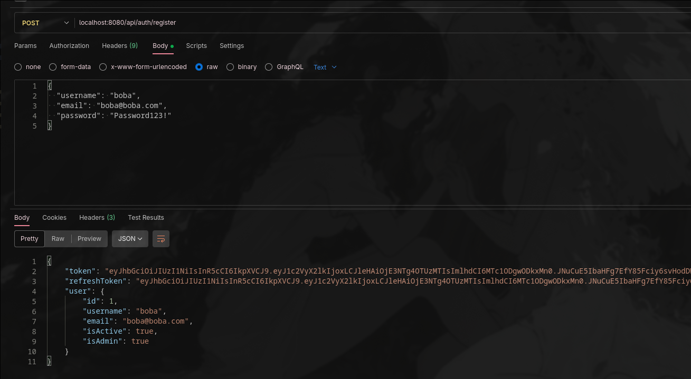
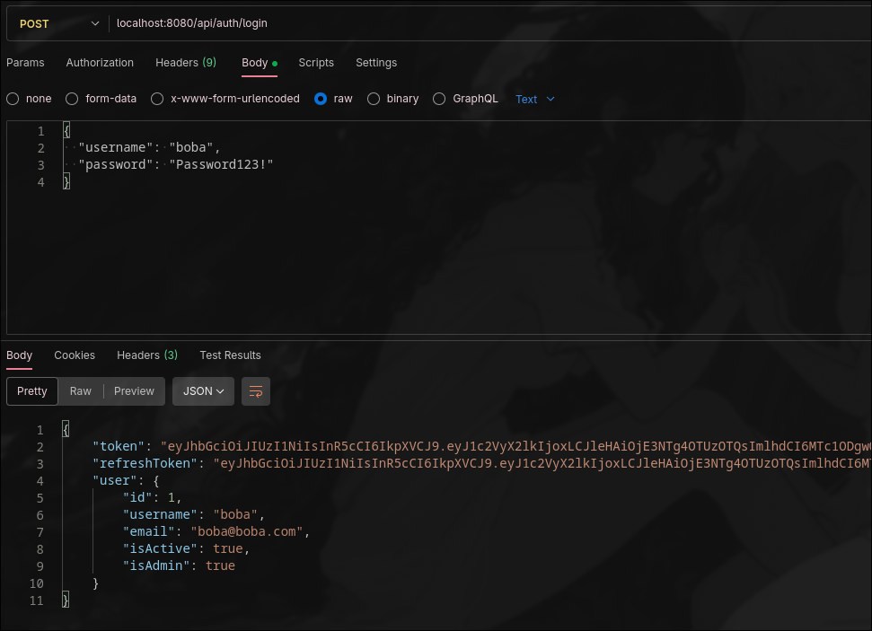
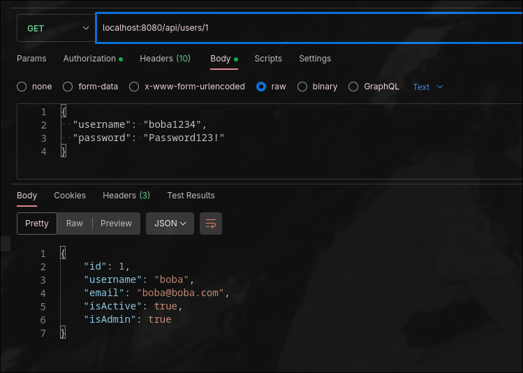
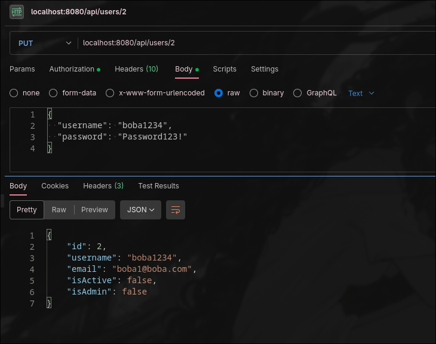

КТ-3. Модель User + Endpoints Admin

Запуск
```sh
go run main.go
```
Обращаться к 
```sh
localhost:8080/api/
```

POST /api/auth/register

POST /api/auth/login

POST /api/users

GET /api/users/id

PUT /api/users/id

DELETE /api/users/id

